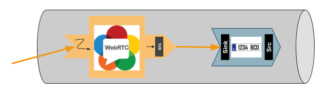

%%%%%%%%%%%%%%%%%%%%%%%%%%%%%%%%%%%
Java Module - Plate Detector Filter
%%%%%%%%%%%%%%%%%%%%%%%%%%%%%%%%%%%

This web application consists on a `WebRTC`:term: video communication in mirror
(*loopback*) with a plate detector filter element.

.. note::

   This tutorial has been configured to use https. Follow the `instructions </features/security.html#configure-java-applications-to-use-https>`_
   to secure your application.

For the impatient: running this example
=======================================

First of all, you should have available: 

-  An instance of kurento running with the kms-platedetector module.
   Further information on the `installation guide </user/installation>`__.

-  An instance of orion running. See: `Orion installation
   guide <https://fiware-orion.readthedocs.io/en/master/admin/install/index.html>`__.

To launch the application, you need:

1. To clone the GitHub project where this demo is hosted:

   .. sourcecode:: bash

      git clone https://github.com/Kurento/kurento-fiware-java
    
2. Install the kurento-fiware module:

   .. sourcecode:: bash

      cd kurento-fiware-java/kurento-fiware
      mvn install 

3. Run the application

   .. sourcecode:: bash

      cd ../kurento-tutorial-java/kurento-platedetector-fiware
      mvn -U clean spring-boot:run -Dkms.url=ws://localhost:8888/kurento 

The web application starts on port 8443 in the localhost by default. Therefore,
open the URL https://localhost:8443/ in a WebRTC compliant browser (Chrome,
Firefox).

.. note::

   These instructions work only if both Kurento Media Server and Orion are up and running in the same machine
   as the tutorial. 

Understanding this example
==========================

This application uses computer vision and augmented reality techniques to detect
a plate in a WebRTC stream on optical character recognition (OCR).

The interface of the application (an HTML web page) is composed by a HTML5
video tag that is activated once the camera is registered in orion. The video camera stream 
(the local client-side stream) is sent to Kurento Media Server, which processes it and 
registers the events rised in Orion. To implement this, we need to create 
a `Media Pipeline`:term: composed by the following `Media Element`:term: s:

   *WebRTC with plateDetector filter Media Pipeline*

The complete source code of this demo can be found in
`GitHub <https://github.com/Kurento/kurento-fiware-java.git>`_.

This example is a modified version of the
`Plate Detector Module Tutorial <https://doc-kurento.readthedocs.io/en/stable/tutorials/java/module-platedetector.html>`__. A screenshot of the
running example is shown in the following picture:

   *Plate detector demo in action*

The following snippet shows how the media pipeline is implemented in the Java
server-side code of the demo. An important issue in this code is that a
listener is added to the ``PlateDetectorFilter`` object
(``addPlateDetectedListener``). This way, each time a plate is detected in the
stream, a message is sent to the client side and the event is registered in Orion. 
As shown in the screenshot above, this event is printed in the console of the GUI.

.. sourcecode:: java

   private void start(final WebSocketSession session, JsonObject jsonMessage) {
	try {
	  // Media Logic (Media Pipeline and Elements)
	  UserSession user = new UserSession();
	  MediaPipeline pipeline = kurento.createMediaPipeline();
	  user.setMediaPipeline(pipeline);
	  WebRtcEndpoint webRtcEndpoint = new WebRtcEndpoint.Builder(pipeline).build();
	  user.setWebRtcEndpoint(webRtcEndpoint);
	  users.put(session.getId(), user);

	  webRtcEndpoint.addIceCandidateFoundListener(new EventListener<IceCandidateFoundEvent>() {

		@Override
		public void onEvent(IceCandidateFoundEvent event) {
		  JsonObject response = new JsonObject();
		  response.addProperty("id", "iceCandidate");
		  response.add("candidate", JsonUtils.toJsonObject(event.getCandidate()));
		  try {
			synchronized (session) {
			  session.sendMessage(new TextMessage(response.toString()));
			}
		  } catch (IOException e) {
			log.debug(e.getMessage());
		  }
		}
	  });

	  PlateDetectorFilter plateDetectorFilter = new PlateDetectorFilter.Builder(pipeline).build();

	  webRtcEndpoint.connect(plateDetectorFilter);
	  plateDetectorFilter.connect(webRtcEndpoint);

	  plateDetectorFilter.addPlateDetectedListener(new EventListener<PlateDetectedEvent>() {
		@Override
		public void onEvent(PlateDetectedEvent event) {

		  final OrionConnectorConfiguration orionConnectorConfiguration = new OrionConnectorConfiguration();

		  final PlateDetectedEventPublisher plateDetectedEventPublisher = new PlateDetectedEventPublisher(
		      orionConnectorConfiguration);

		  DevicePlateDetectedEvent extendedEvent = new DevicePlateDetectedEvent(event, null);

		  // TODO add the camera information (from {@link: CameraSession}

		  JsonObject response = new JsonObject();
		  response.addProperty("id", "plateDetected");
		  response.addProperty("plate", event.getPlate());
		  log.debug("plateDetectorFilter.onEvent({}) => {}", event.getPlate(), response.toString());
		  try {
			session.sendMessage(new TextMessage(response.toString()));
			plateDetectedEventPublisher.publish(extendedEvent);
			log.debug("");
		  } catch (OrionConnectorException e) {
			log.warn("Could not publish event in ORION");
			sendError(session, e.getMessage());
		  } catch (Throwable t) {
			log.warn("Thowable: {}", t.getLocalizedMessage());
			sendError(session, t.getMessage());
		  }
		}
	  });

	  // SDP negotiation (offer and answer)
	  String sdpOffer = jsonMessage.get("sdpOffer").getAsString();
	  String sdpAnswer = webRtcEndpoint.processOffer(sdpOffer);

	  // Sending response back to client
	  JsonObject response = new JsonObject();
	  response.addProperty("id", "startResponse");
	  response.addProperty("sdpAnswer", sdpAnswer);

	  synchronized (session) {
		session.sendMessage(new TextMessage(response.toString()));
	  }

	  webRtcEndpoint.gatherCandidates();

	} catch (Throwable t) {
	  sendError(session, t.getMessage());
	}
  }

Dependencies
============

This Java Spring application is implemented using `Maven`:term:. The relevant
part of the
`pom.xml <https://github.com/Kurento/kurento-tutorial-java/blob/master/kurento-show-data-channel/pom.xml>`_
is where Kurento dependencies are declared. As the following snippet shows, we
need four dependencies: the Kurento Client Java dependency (*kurento-client*)
and the JavaScript Kurento utility library (*kurento-utils*) for the
client-side, the KMS platedetector module (*platedetector*) and the kurento-fiware 
module (*kurento-fiware*). 

.. sourcecode:: xml
	...
   <dependencies>
       <dependency>
      <groupId>org.kurento</groupId>
      <artifactId>kurento-client</artifactId>
    </dependency>
    <dependency>
      <groupId>org.kurento</groupId>
      <artifactId>kurento-utils-js</artifactId>
    </dependency>
    <dependency>
      <groupId>org.kurento.module</groupId>
      <artifactId>platedetector</artifactId>
    </dependency>
    <dependency>
      <groupId>org.kurento</groupId>
      <artifactId>kurento-fiware</artifactId>
      <version>${kurento.integration.version}</version>
    </dependency>
   </dependencies>
   ...

